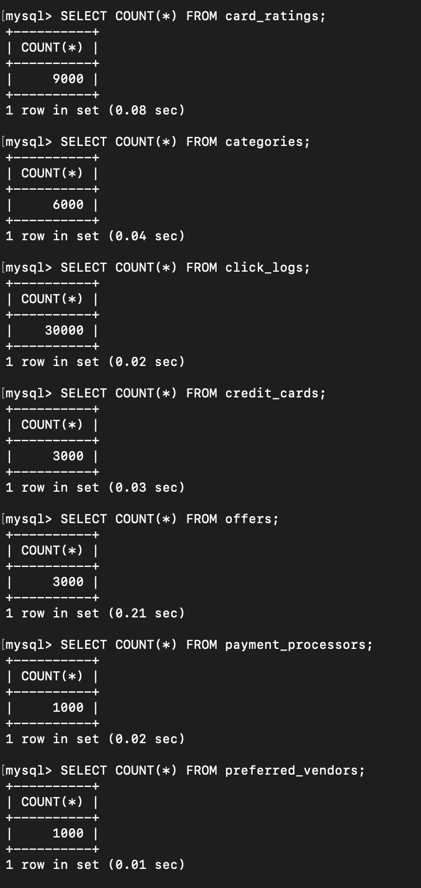

## Database Implementation and Indexing:

# Database Implementation

**Database Tables**


**DDL:**

```sql
CREATE TABLE Payment_Processors(
    processor_id INT PRIMARY KEY,
    processor_name VARCHAR(255) NOT NULL,
    domestic_accept INT,
    international_accept INT,
    total_cards_us INT,
    total_vol_us INT,
    num_trans INT,
    avg_proc_fee REAL
);

CREATE TABLE Credit_Cards(
    card_id INT PRIMARY KEY,
    card_name VARCHAR(255) NOT NULL,
    processor_id INT,
    bank VARCHAR(255),
    annual_fee REAL,
    credit_limit REAL,
    signup_bonus REAL,
    APR_min REAL,
    APR_max REAL,
    min_rec_credit INT,
    image_url VARCHAR(255),
    signup_link VARCHAR(255),
    foreign_trans_fee REAL,
    reward_type CHAR(1),
    CONSTRAINT cc_fk_processor_id
        FOREIGN KEY (processor_id) 
        REFERENCES Payment_Processors(processor_id) 
        ON DELETE SET NULL
);


CREATE TABLE Preferred_Vendors(
    vend_id INT PRIMARY KEY,
    vend_name VARCHAR(255) NOT NULL,
    vend_type VARCHAR(255),
    vend_website VARCHAR(255)
);

CREATE TABLE Offers(
    card_id INT,
    vend_id INT,
    CONSTRAINT offer_fk_card_id
        FOREIGN KEY (card_id) 
        REFERENCES Credit_Cards(card_id) 
        ON DELETE CASCADE,
    CONSTRAINT offer_fk_vend_id
        FOREIGN KEY (vend_id) 
        REFERENCES Preferred_Vendors(vend_id) 
        ON DELETE CASCADE
);

CREATE TABLE Categories(
    cat_id INT PRIMARY KEY,
    card_id INT,
    cat_name VARCHAR(255) NOT NULL,
    cat_desc VARCHAR(255) NOT NULL,
    reward REAL,
    CONSTRAINT cat_fk_card_id 
        FOREIGN KEY (card_id)
        REFERENCES Credit_Cards(card_id) 
        ON DELETE CASCADE
);

CREATE TABLE Card_Ratings(
    rating_id INT PRIMARY KEY,
    card_id INT NOT NULL,
    website_name VARCHAR(255),
    rating REAL,
    CONSTRAINT rate_fk_card_id 
        FOREIGN KEY (card_id) 
        REFERENCES Credit_Cards(card_id) 
        ON DELETE CASCADE
);

CREATE TABLE Click_Logs(
    click_id INT PRIMARY KEY,
    card_id INT,
    date_time VARCHAR(255),
    ip_addr VARCHAR(255),
    CONSTRAINT click_fk_card_id
        FOREIGN KEY (card_id)
        REFERENCES Credit_Cards(card_id) 
        ON DELETE CASCADE
);
```

**Records Per Table**

The dummy data was randomly generated using the jupyter notebook:

https://github.com/cs411-alawini/fa22-cs411-Q-team037-Feb31st/blob/master/dummy_data/genData.ipynb

The code generates commands that can be directly ran in the database shell, check the following link for Credit_Card data as an example:

https://github.com/cs411-alawini/fa22-cs411-Q-team037-Feb31st/blob/master/dummy_data/Credit_Cards.txt

Additionally, the following sql dump file can be used to generate the full database with the dummy data:

https://github.com/cs411-alawini/fa22-cs411-Q-team037-Feb31st/blob/master/sql/db_dump.sql



# Advanced Queries

**Advanced Query 1:**

Lists the cards that have been clicked on the most in the last 7 days according to the click_logs table.

```
-- query trending data
SELECT cc.card_name, COUNT(cl.card_id) AS total_requests
FROM credit_cards cc NATURAL JOIN click_logs cl
-- user requests from last 7 days
WHERE TIMESTAMPDIFF(DAY, CURRENT_TIMESTAMP(), cl.date_time) < 7
GROUP BY cc.card_id
-- get 10 records with most requests
ORDER BY total_requests DESC
LIMIT 15;
```

**Advanced Query 1 output:**


**Advanced Query 2:**

Returns a list of cards organized by user_specification_card_rating which is an arbitrary index that shows a weighted approximation of how well each card matched the search results. The maximum number for user_specification_card_rating is 1001. It also shows the average rating of each card according to the card_ratings table.
```
SET @vend_name_filter = "udukjemrx,ehmoqgkgt,yaulwjrlp,yhoszxcmw";
SET @vend_type_filter = "rpikaoxq,kmcppyba,xsxkvxxu";
SET @credit_score_min_filter = 300;
SET @credit_limit_min_filter = 1000;
SET @annual_fee_max_filter = 0;
SET @payment_processor_filter = "lzufuua,yytgtej,rmlyjku";

SELECT cc.card_name,
    -- use this aggregation to get weighted number to select appropriate ranking
    -- flags with higher multipliers indicate greater importance in our ranking metric
    (400 * credit_score_flag + 300 * credit_limit_flag + 200 * payment_processor_flag +
            100 * annual_fee_flag + COALESCE(vendor_requirements_counts, 0)) AS user_specification_card_rating,
    average_rating
FROM credit_cards cc
-- determine number of vendor matches a card has
LEFT JOIN (
    SELECT cc1.card_id, COUNT(pv1.vend_id) AS vendor_requirements_counts
    FROM credit_cards cc1
    NATURAL JOIN offers o1 NATURAL JOIN preferred_vendors pv1
    WHERE (FIND_IN_SET(pv1.vend_type, @vend_type_filter) OR FIND_IN_SET(pv1.vend_name, @vend_name_filter))
    GROUP BY cc1.card_id
) vendorsub ON cc.card_id = vendorsub.card_id
-- determine if credit card meets certain requirements, use numbers for aggregation formula
JOIN (
    SELECT 
        cc2.card_id, 
        IF (cc2.min_rec_credit >= @credit_score_min_filter, 1, 0) AS credit_score_flag,
        IF(cc2.credit_limit >= @credit_limit_min_filter, 1, 0) AS credit_limit_flag,
        IF(cc2.annual_fee <= @annual_fee_max_filter, 1, 0) AS annual_fee_flag
    FROM credit_cards cc2
) cardsub ON cc.card_id = cardsub.card_id
-- determine if credit card uses one of specified payment processors, use numbers for aggregation formula
JOIN (
    SELECT cc3.card_id, IF(FIND_IN_SET(pp3.processor_name, @payment_processor_filter), 1, 0) AS payment_processor_flag
    FROM credit_cards cc3 NATURAL JOIN payment_processors pp3
) processorsub ON cc.card_id = processorsub.card_id
-- get average rating to use as tiebreaker if we still have multiple cards
LEFT JOIN (
    SELECT cc4.card_id, AVG(cr.rating) AS average_rating
    FROM credit_cards cc4
    NATURAL JOIN card_ratings cr
    GROUP BY cc4.card_id
) ratingsub ON cc.card_id = ratingsub.card_id
ORDER BY user_specification_card_rating DESC, average_rating DESC
LIMIT 15;
```
**Advanced Query 2 output:**


# Indexing Analysis

The code used for the following procedures can be found at /sql. The specific output is found at:

https://github.com/cs411-alawini/fa22-cs411-Q-team037-Feb31st/blob/master/sql/Server_Executed_Query_Explain_Analyze.md

**Summary of Trending Data (Query 1) Indexing**

baseline cost (time):&ensp;&ensp;&ensp;&ensp;&ensp;&ensp;&ensp;&ensp;&ensp;&ensp;13894.66 <br/>
index on date_time:&ensp;&ensp;&ensp;&ensp;&ensp;&ensp;&ensp;&ensp;&ensp;&ensp;13894.66 <br/>
index on card_id:&ensp;&ensp;&ensp;&ensp;&ensp;&ensp;&ensp;&ensp;&ensp;13894.66 <br/>
index on card_name:&ensp;&ensp;&ensp;&ensp;&ensp;13894.66

For all 3 of the indices, we were unable to reduce the cost or improve the performance of our queries. In the case of the date_time index, we were hoping that the addition of this index would assist with the filtering to only get records from the last 7 days. However, this did not alter the query plan in anyway and thus the execution remained the same. It appears that the computation in the WHERE clause which was included in date_time may have been the issue. We may need to explore altering the click_log table to add a date_time field. In the case of the card_id index, we were hoping that this index would help for the join of the click_log table to the credit_cards table. However, this also did not have an impact on the cost or performance. Prior to running this query, we were unaware that by default any foreign keys (card_id) was a foreign key of card_name automatically have indicies. Finally, we attempted to index on card_name to help with the sorting related to our aggregation. Again, based on the explain analyze, it appears that indexing on a sorted value does not help to boost performance. Since this query is relatively straightforward in terms of its' joins (PK to FK) and the structure of the date_time field and the way the WHERE clause is called, it appears we are not able to further optimize this query with indexing.

**Summary of Card Recommendations (Query 2) Indexing Analysis**


baseline cost:&ensp;&ensp;&ensp;&ensp;&ensp;&ensp;&ensp;&ensp;&ensp;&ensp;87152.76 <br/>
index on vend_type:&ensp;&ensp;&ensp;&ensp;&ensp;&ensp;&ensp;&ensp;&ensp;&ensp;87152.76 <br/>
index on vend_name:&ensp;&ensp;&ensp;&ensp;&ensp;&ensp;&ensp;&ensp;&ensp;87152.76 <br/>
index on processor_name:&ensp;&ensp;&ensp;&ensp;&ensp;87152.76 

It seems that none of the added indexes increased the speed of the query. This is probably due to the fact that there are many sub-queries being made and a lot of the processing in the query was done on temporary tables. To speed up the the query with indexes, it might be necessary to first simplify the query as much as possible to remove any unnecessary temporary tables and force most of the scanning to be done on tables with defined indexes. In addition, most of the conditionals are actually included in the select clause or when included in the where clause require the usage of FIND_IN_SET which seems to not be able to take advantage of the indexing. To best evaluate a query with so many nested subqueries, it may be necessary to break the query into smaller chunks to allow for simplified evaluation. In addition, the final result doesn't really perform any filtering since every record from the credit cards table gets returned with a score in a sorted order.

