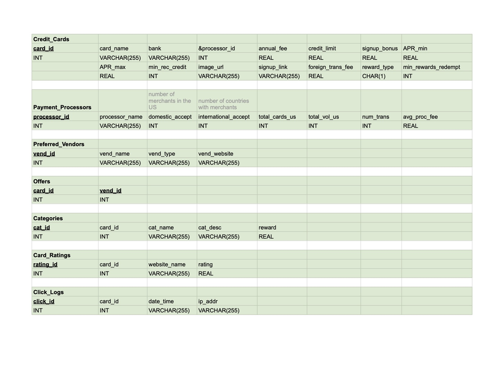
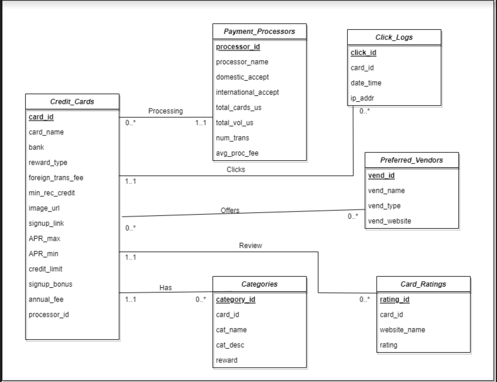
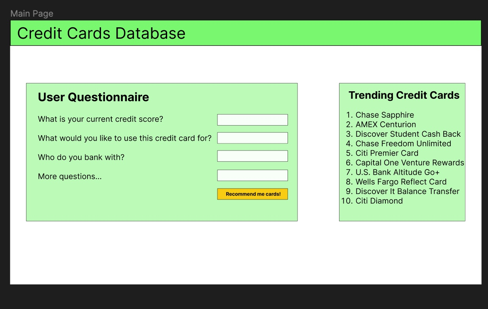
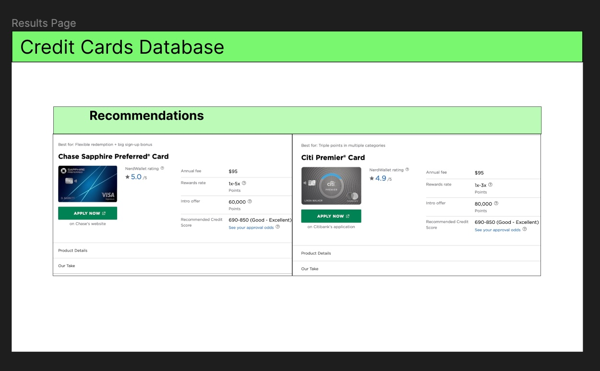
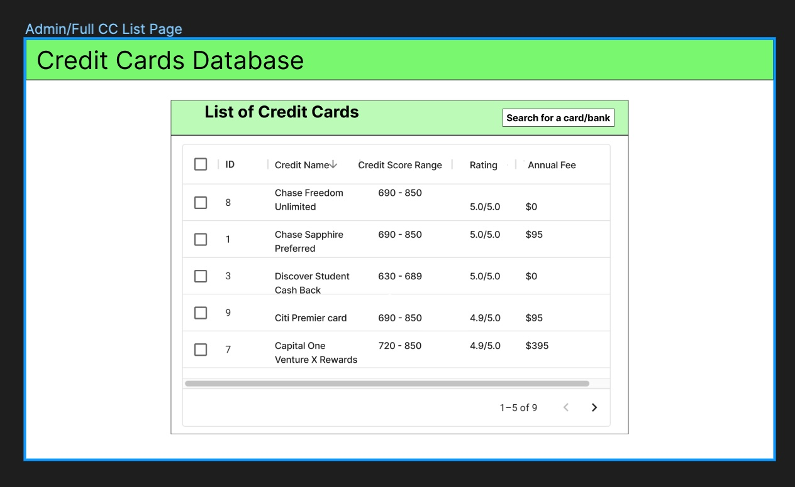

## Illini CC'd

# Summary

Many websites provide details and information on various credit cards. Although all of these cards have standardized information, users often must toggle through many pages and websites to see all of the relevant details for the hundreds of available credit cards. While some websites such as [NerdWallet](https://www.nerdwallet.com/) and [CreditKarma](https://www.creditkarma.com/), compile subsets of credit cards and provide some manually curated comparisons, this information is limited to a small subset of credit cards and is often text based making it more difficult for users to provide broader comparisons. In addition, to get more minor details, users must toggle to the actual card’s website to view details related to preferred vendors, point redemption, and APR. 

Illini CC’d will be a website which contains a compiled and standardized dataset of hundreds of different credit cards. By having a single standardized source of information for all things credit card, users of Illini CC’d will be able to quickly evaluate credit cards, perform comparisons, and select the credit card which best suits their needs. In addition, this solution will stand out by providing users a single UI for all credit cards versus having to toggle through many different pages. The website will include a summary table which shares with users standardized details of the many credit cards available on the market. Users will also be able to execute customized searches and filters on this table to help identify subsets of cards which meet their needs. In addition, by answering several questions, users will be able to receive personalized credit card recommendations. Finally, users will be able to see what credit cards other users of the site are looking at to gain a better understanding of what cards are currently popular.

# Description

Our application will contain a database with information about credit cards, payment processors, preferred vendors (ex. American Airlines, Marriott Hotels, etc.), categories of spending (ex. grocery, amazon, online, etc.), card popularity and card ratings. The specific information for each table can be seen in the screenshot below which displays the different table schemas. In addition, the following UML diagram shows how the different tables will ultimatley relate to each other. There will be a summary table containing general information on each card in the system, as well as how it compares to other cards. In particular, it will include hard-to-find information about each card, show ratings and the pros and cons of each card from multiple credit card rating sites to give a more holistic representation about the quality of each card. We will also give a recommendation for particular cards depending on input given by the user and display particular cards that are popular at the time. The user will also be able to search and filter cards based on keyword searches.

# Usefulness

There are a lot of credit card comparison websites out there, but ours will stand out for two reasons: A clean display table with custom metrics for each credit card, and a custom search function that allows for customization of each parameter of the credit card offer that includes hard-to-find details about each credit card.

Websites like [CardRatings](https://www.cardratings.com/), [NerdWallet](https://www.nerdwallet.com/), and [CreditKarma](https://www.creditkarma.com/) all list credit cards, ratings, and show details about each credit card. Our database will include attributes of each credit card that are normally not listed such as foreign transaction fees and minimum reward redemption requirements. In addition to this, we will have a trending section that will list credit cards that are being viewed particularly often. It will also compile ratings from these websites which will give a more holistic representation of the quality of the cards. Admins will be able to insert, update, and delete cards from our database as needed to ensure that our data is up to date and accurate. 

# Realness

We will use Python to collect our data via web-scraping and will then clean and process the data before inserting it into the database. To get standardized data on each of the credit cards, we will pull all credit card data from cardratings.com, which provides a comprehensive list of credit cards available in the United States and Canada and links to webpages which provide more detailed card descriptions. The data we will collect will include information such as the range of Annual Percentage Rate (APR), the bank associated with the card, the annual fee for the credit card, the credit limit, a URL for the card image, the card processor, the standard number of points for each transaction, and more. In addition, cardratings.com also has extensive textual details on the different preferred vendors (ex. Amazon, American Airlines, Marriott Hotels, etc.) these credit cards have which will allow us to identify the vendors who are associated with each card. Individuals often are able to get extra points when using their card at one of the card’s preferred vendors or are able to redeem their points through these vendors. For individuals who regularly buy things from these vendors, this information has the potential to be extremely valuable for credit card selection.

In addition to this primary data which will feed the credit card table, we will also have several supplementary pieces of data which will also be scraped. We pull credit card review data from NerdWallet, CreditKarma, and Forbes to help our users understand general sentiment around these different cards. The review data will be focused on actual scores (ex. 5 stars). Data on the individual payment processors (ex. MasterCard, American Express) will also be collected manually since there are only 4 major payment processors in the US. Information included here will be related to the number of companies which accept cards from that processor, the usage rate of these processors in the US, the number of countries which accept these cards, and the average processing fee. For certain processors, fewer places may accept their cards due to processing fees so it is important for our users to know if a potential card may be rejected more frequently. 

Finally, we will collect data based on the credit cards our users view to populate trending data. We will initially populate the trending data with artificial data based on “sample users” by generating random user activity but will then continue to update the database as people use the application. In order to make the artificial trending data more realistic, we will manually identify and select a subset of popular credit cards and will skew our sample data to favor these cards. Once the application is up and running, the trending data will continue to be collected as users perform actions to get more detail about specific cards. When one of these qualifying actions is performed, the UI will automatically call a backend endpoint, which will insert a record into the database to log the “click event” for that particular credit card. This information will include a unique identifier for the click, the time the click was performed, the card which was selected, and the ip address which made the request.

# Functionality

Our application will have a user interface and an admin side. General users will be able to query the database by inputting personal information, as well as desired credit card metrics of their choice. The recommended credit cards for their input will pop up for visualization. Additionally, the data on which credit cards are trending will be recorded and calculated based on user input on the backend. The admin side will allow for the insertion, update, and deletion of the database records by including extra elements on each page visible only when an admin is logged in.

Potential extra functionalities if we have time for it:
* Adding a “favorite” system on the user end.
* Adding a review system user end.

"Trending system"
* Logs when user clicks on a specific card and records the time/card ID
    * We will determine whether a card is trending based on its relative views/clicks in a certain time frame
* An admin can create (insert), update, and delete records manually.
    * To log in as an admin, we may have a secret page or a way (such as via just an HTTP POST request) where an admin submits the secret key to the back-end, which will grant them admin privileges for that session. Now, the admin will see a slightly modified view of the page, with additional interfaces for performing CRUD operations on the records.
    * This will help prevent malicious actors from messing with our database. 

1. Get recommendations based on specific attributes
2. View all credit cards available
3. Select and compare a list of credit cards
4. Search for a specific card based on bank or credit card name
5. Filter to a list of credit cards according to certain attributes
6. “Insert new rows” - logs user inputs
    * We can track which cards the users click on and that will affect which cards are “trending”.

# UI Mockup

Although the below 3 UI images suggest 3 separate pages, we plan to implement a single fluid UI that will overlay additional information on top of the main page.

The main page of the site will display an input section for users to provide info that will help us provide a recomendation on the appropriate card for them.

The results page will display a credit card either selected manually by user or recommended based on user specification. In addition to the first card, there will be a second card which is considered a "similar" card to the first card. Relevent data, details and links will be included on this view.

The credit card table will contain a list of all credit cards and will have various functionality to allow users to filter to a subset of credit cards. Users will be able to filter on attributes or perform searches on specific columns.

# Work Distribution

*Data Collection*:
* Scrape Credit Card Data KK
* Collect Processor Info - MG
* Scrape Review Info - MG
* Collecting data when user views specific credit card - TJ

*Database Setup*:
* Table Schemas - KK
* UML conversion - GB
* Stored Procedures
    * Pull Credit Card Data for UI display - KK
    * Select credit card based on user input request - KK
    * Update trend data based on user requests - TJ
    * Load subset of columns for general card table - KK
    * Load trending data - TJ
    * Admin adding records - MG
    * Admin removing records - MG
    * Admin updating records - MG
    * Inserting Data - KK
* Transferring local code to Google Cloud/Setting up Google Cloud - GB

*Card Recommender*:
* User Input Collection by UI - TJ
* Backend Processing to Convert User Input and Call Stored Procedure - TJ

*Card Display (shows specific cards)*:
* User selection of card in UI (click trending card, click row, click table) - MG
* Based on selected credit card, call stored procedure to get data - MG
* Backend Processing to Accept Results and Convert to Format for UI - MG
* Display results in UI including credit card image - MG

*Trending*:
* Displaying data based on the database - KK
* Updating information from the database each hour - GB

*Card Table (lists lots of card info)*:
* Displaying data based on user actions on the table (click filters, search, etc.) - TJ